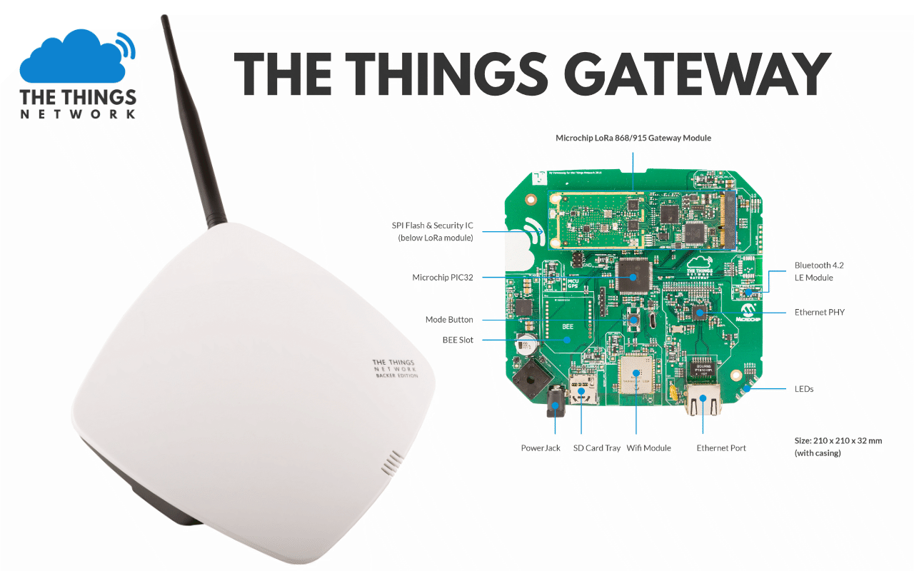

# The Things Gateway

## Where to buy

A list of resellers can be found [here](https://www.thethingsnetwork.org/the-things-products).

## Enclosure

Designs of the enclosure can be found in the [enclosure](./enclosure) directory. These designs are licensed under a [Creative Commons Attribution-ShareAlike 4.0 International License](http://creativecommons.org/licenses/by-sa/4.0/).

## Hardware

Designs of the hardware can be found in the [hardware](./hardware) directory. These designs are licensed under a [Creative Commons Attribution-ShareAlike 4.0 International License](http://creativecommons.org/licenses/by-sa/4.0/).

## Firmware

Firmware source code is located in the [firmware](./firmware) directory. Firmware source code is released under a [MIT License](https://opensource.org/licenses/MIT).

## Feature Requests, Bug Reports and Support

- For feature requests and bug reports, create an [issue on Github](https://github.com/TheThingsProducts/gateway/issues)
- Community support on our [forum](https://www.thethingsnetwork.org/forum/c/gateways/the-things-gateway)
- Commercial support by [e-mail](mailto:support@thethingsproducts.com)
